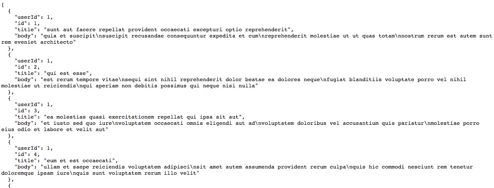

# AlamofireTemplate
For test purposes we will we using a fake online api called json place holder.  
In this i explain the implementation of a GET request and a POST request. 
 
and here is an example of the json file from the api 
 
